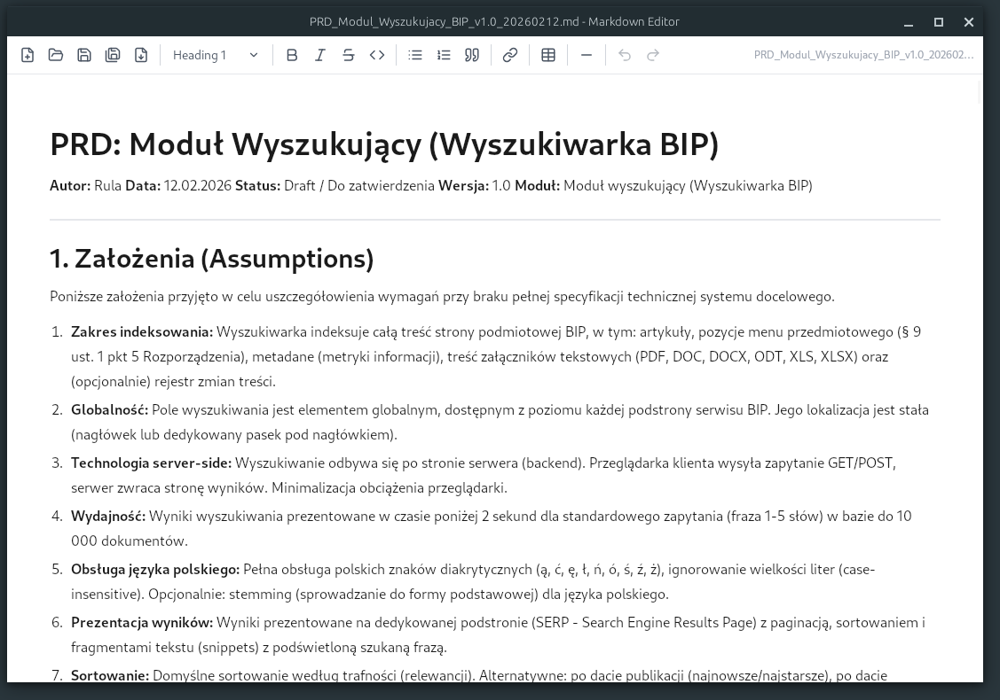

# Free Markdown Editor for Linux/Windows  

A native, lightweight WYSIWYG Markdown editor built with Tauri 2 (Rust + React).



## Table of Contents

- [Description](#description)
  - [Document Editing](#document-editing)
  - [File Handling](#file-handling)
  - [Interface](#interface)
- [Download](#download)
- [Features](#features)
- [Requirements](#requirements)
- [Running (dev)](#running-dev)
- [Building](#building)
- [Tech Stack](#tech-stack)

## Description

Markdown Editor is a desktop application for editing Markdown files in WYSIWYG mode. The application renders a formatted document in real time, without switching between source code and preview.

### Document Editing

The application uses the TipTap editor (based on ProseMirror), which renders content as formatted text. The user works with the document as in a text editor: selects text, clicks toolbar buttons or uses keyboard shortcuts. Internally, the document is stored as HTML and converted to Markdown syntax on save (turndown library) and from Markdown to HTML on open (markdown-it library).

Supported formatting elements: headings H1-H6, bold, italic, strikethrough, inline code, code blocks, bullet and ordered lists, checklist (`- [ ]` / `- [x]`), blockquotes, links, tables (with resizable columns) and horizontal rules.

### File Handling

Files can be opened in four ways: via a native system dialog (Ctrl+O), by dragging a file into the application window (drag & drop), by passing a path as a command-line argument (`markdown-editor document.md`), or through file extension associations (`.md`, `.markdown`, `.txt`) registered with the operating system.

Saving is done in Markdown format (.md). HTML export is also available. The application monitors the open file using the native OS file watching mechanism (inotify on Linux, ReadDirectoryChanges on Windows). If another program modifies the file, the editor automatically reloads the new content.

The window title bar displays the file name and an asterisk (`*`) for unsaved changes. When attempting to close a document with unsaved changes, the application shows a warning.

### Interface

The toolbar contains formatting buttons, a heading dropdown menu, table operations and undo/redo buttons. On the right side there is a zoom selector (50-200%, persisted between sessions) and the current file name.

The application uses the native OS WebView (WebKitGTK on Linux, WebView2 on Windows), resulting in an installer size of approximately 5-10 MB.

## Download

| System | File | Link |
|--------|------|------|
| Windows (installer) | `.exe` | [Download](https://github.com/rskonieczka/markdown-editor/releases/latest/download/Markdown.Editor_1.0.0_x64-setup.exe) |
| Windows (MSI) | `.msi` | [Download](https://github.com/rskonieczka/markdown-editor/releases/latest/download/Markdown.Editor_1.0.0_x64_en-US.msi) |
| Linux (Debian/Ubuntu) | `.deb` | [Download](https://github.com/rskonieczka/markdown-editor/releases/latest/download/Markdown.Editor_1.0.0_amd64.deb) |
| Linux (universal) | `.AppImage` | [Download](https://github.com/rskonieczka/markdown-editor/releases/latest/download/Markdown.Editor_1.0.0_amd64.AppImage) |

## Features

- **WYSIWYG** - edit as in a document, no Markdown syntax knowledge required
- **Toolbar** - headings H1-H6, Bold, Italic, Strike, Code, lists, blockquote, checklist, link, table, horizontal rule, undo/redo
- **Checklist** - interactive task list `- [ ]` / `- [x]` with full Markdown round-trip
- **File management** - New, Open, Save, Save As (.md), Export HTML
- **File watcher** - automatic reload on external changes (native inotify/ReadDirectoryChanges)
- **Drag & Drop** - drag .md/.markdown/.txt files into the editor
- **CLI** - open files from the command line: `markdown-editor file.md`
- **Zoom** - view scaling 50-200% (persisted in localStorage)
- **Keyboard shortcuts** - Ctrl+N/O/S/Shift+S/B/I/K/Z
- **Dirty flag** - unsaved changes warning, file name in window title
- **Cross-platform** - Windows (.exe, .msi) and Linux (.deb, .AppImage)
- **CI/CD** - GitHub Actions automatically builds releases
- **Lightweight** - ~5-10 MB thanks to Tauri (native WebView)

## Requirements

- Node.js 18+
- Rust 1.70+
- Linux: `libwebkit2gtk-4.1-dev`, `libappindicator3-dev`, `librsvg2-dev`
- Windows: WebView2 (included by default in Win10/11)

## Running (dev)

```bash
# Frontend only (browser)
npm install
npm run dev

# Native Tauri application
npm install
cargo tauri dev
```

## Building

```bash
cargo tauri build

# Artifacts:
# Windows -> src-tauri/target/release/bundle/nsis/*.exe
# Linux   -> src-tauri/target/release/bundle/appimage/*.AppImage
```

## Tech Stack

- Tauri 2.x (Rust backend + native WebView)
- React 18 + Vite
- TipTap 2 (ProseMirror)
- TailwindCSS 3
- Lucide React (icons)
- turndown + markdown-it (MD <-> HTML conversion)
