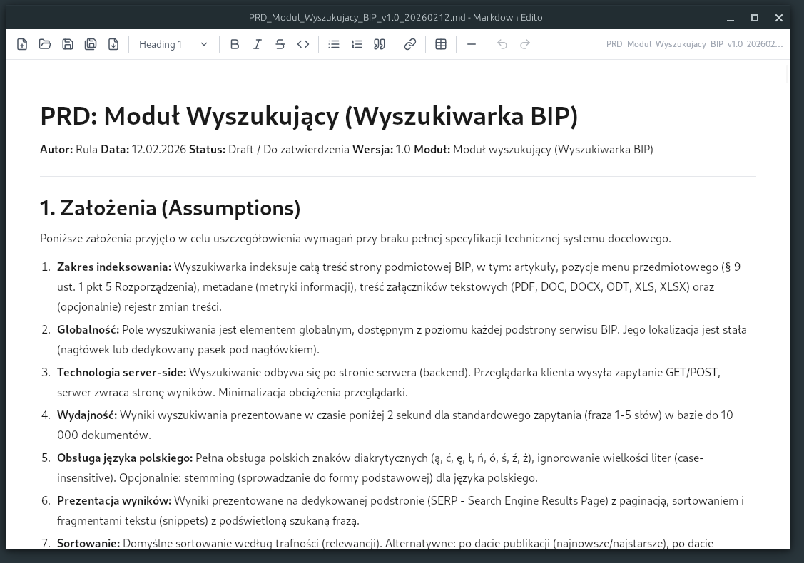

# Markdown Viewer for Linux/Windows

A native, lightweight Markdown viewer built with Tauri 2 (Rust + React).

> Current mode: read-only viewer with zoom and font controls.



## Table of Contents

- [Description](#description)
  - [Document Rendering](#document-rendering)
  - [File Input](#file-input)
  - [Interface](#interface)
- [Download](#download)
- [Features](#features)
- [Requirements](#requirements)
- [Running (dev)](#running-dev)
- [Building](#building)
- [Tech Stack](#tech-stack)

## Description

Markdown Viewer is a desktop application for displaying Markdown files as formatted documents. The current version is read-only: it renders content without editing, saving or export actions.

### Document Rendering

The application converts Markdown to HTML with `markdown-it` and displays the result through TipTap/ProseMirror in read-only mode. This keeps the rendered document layout consistent while removing document editing from the UI.

Rendered content supports the elements configured in the viewer pipeline, including headings H1-H6, bold, italic, strikethrough, inline code, code blocks, bullet and ordered lists, checklist (`- [ ]` / `- [x]`), blockquotes, links and tables.

### File Input

The Tauri backend reads the first non-flag command-line argument and, if it points to an existing file, passes its absolute path, file name and content to the frontend. In practice this allows launching the packaged application with a file path, for example:

```bash
markdown-editor document.md
```

The Tauri bundle also declares file associations for `.md`, `.markdown` and `.txt`, so opening those files from the operating system can route them into the viewer. When a file path is available, the application monitors it with the native file watching mechanism and reloads the document after external changes.

If the application starts without a file, it opens an empty viewer window.

### Interface

The toolbar contains only two controls:

- zoom selector in the range 50-200%
- font family selector persisted in `localStorage`

The document area is scrollable and rendered in read-only mode. When a file is loaded, the window title uses the current file name.

The application uses the native OS WebView (WebKitGTK on Linux, WebView2 on Windows), resulting in an installer size of approximately 5-10 MB.

## Download

| System | File | Link |
|--------|------|------|
| Windows (installer) | `.exe` | [Download](https://github.com/rskonieczka/markdown-editor/releases/latest/download/Markdown.Editor_1.0.0_x64-setup.exe) |
| Windows (MSI) | `.msi` | [Download](https://github.com/rskonieczka/markdown-editor/releases/latest/download/Markdown.Editor_1.0.0_x64_en-US.msi) |
| Linux (Debian/Ubuntu) | `.deb` | [Download](https://github.com/rskonieczka/markdown-editor/releases/latest/download/Markdown.Editor_1.0.0_amd64.deb) |
| Linux (universal) | `.AppImage` | [Download](https://github.com/rskonieczka/markdown-editor/releases/latest/download/Markdown.Editor_1.0.0_amd64.AppImage) |

## Features

- **Read-only Markdown rendering** - display formatted Markdown without edit mode
- **CLI file input** - open a file by passing its path: `markdown-editor file.md`
- **OS file associations** - packaged app declares `.md`, `.markdown` and `.txt`
- **File watcher** - automatic reload on external changes when a file path is available
- **Zoom** - view scaling 50-200% persisted in `localStorage`
- **Font selector** - switch document font without modifying content
- **Task lists and tables** - render structured Markdown content in the viewer surface
- **Cross-platform** - Windows (.exe, .msi) and Linux (.deb, .AppImage)
- **Lightweight** - ~5-10 MB thanks to Tauri (native WebView)

## Requirements

- Node.js 18+
- Rust 1.70+
- Linux: `libwebkit2gtk-4.1-dev`, `libappindicator3-dev`, `librsvg2-dev`
- Windows: WebView2 (included by default in Win10/11)

## Running (dev)

```bash
npm install

# Frontend only (browser preview)
npm run dev

# Native Tauri application
cargo tauri dev
```

Browser mode is useful for UI work, but native file input and file watching are only available in the Tauri application.

## Building

```bash
npm install
cargo tauri build

# Typical output paths:
# Native binary -> src-tauri/target/release/markdown-editor
# Linux .deb    -> src-tauri/target/release/bundle/deb/*.deb
# Linux .rpm    -> src-tauri/target/release/bundle/rpm/*.rpm
# Linux AppImage -> src-tauri/target/release/bundle/appimage/*.AppImage
```

Release artifact names and bundle metadata still use the legacy internal naming `Markdown Editor` / `markdown-editor`.

On Linux, `.deb` and `.rpm` bundles may be produced even when the AppImage step fails later. If AppImage bundling stops at `linuxdeploy`, verify your AppImage tooling and Linux packaging dependencies before retrying the full bundle.

## Tech Stack

- Tauri 2.x (Rust backend + native WebView)
- React 18 + Vite
- TipTap 2 (ProseMirror) used as a read-only document surface
- TailwindCSS 3
- markdown-it + markdown-it-task-lists (Markdown to HTML rendering)

## License

MIT
